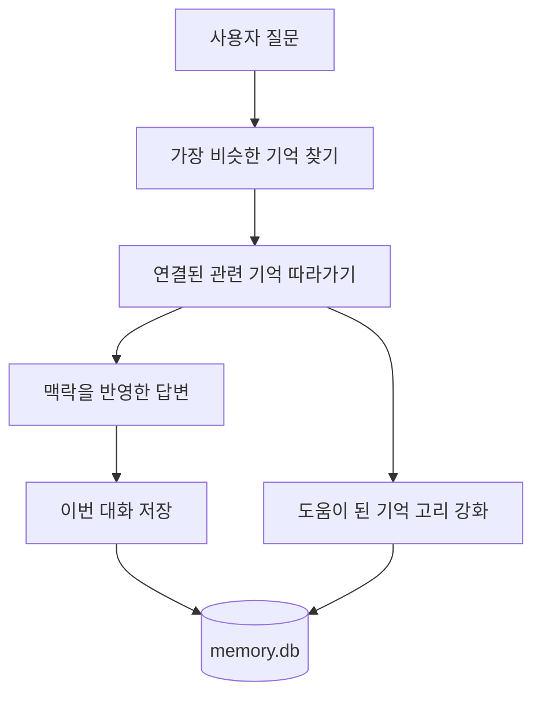

# [ㄱ] 안내서

부제: 하나의 기억에서 다음 기억으로 이어지는 보조도구

## 1. 이름

이 도구의 이름은 **[ㄱ]** 입니다.

영문 표기는 **Giyeok** 으로 두는 것이 가장 자연스럽습니다.
`ㄱ`은 한글 자모 이름으로는 `기역` 또는 `기억`에 가깝게 읽히고,
영문으로는 `Giyeok`이 가장 직접적으로 연결됩니다.

이 이름에는 세 가지 의미를 함께 담을 수 있습니다.

- 한글의 첫 자음처럼 출발점이 되는 기억
- 하나의 기억에서 다음 기억으로 이어지는 연결
- 짧고 강한 표기지만, 내부적으로는 촘촘한 연상 구조를 가진 도구

이 도구는 메모를 단순히 쌓아두는 보관함이 아니라,  
하나의 기억에서 관련 기억이 줄줄이 따라 나오게 만드는 구조를 가집니다.

그래서 이 도구는 긴 설명형 이름보다  
**[ㄱ]** 이라는 짧은 이름이 더 잘 맞습니다.

## 2. 한 줄 소개

**[ㄱ]은 대화와 작업 내용을 저장해 두었다가, 나중에 비슷한 상황이 오면 관련 기억을 연상으로 다시 꺼내주는 기억 보조도구입니다.**

## 3. 무엇이 다른가

보통 메모 도구는 이렇게 동작합니다.

1. 내가 메모를 적는다.
2. 나중에 같은 단어로 검색한다.
3. 정확히 맞는 표현이 있어야 찾기 쉽다.

[ㄱ]은 조금 다르게 움직입니다.

1. 내가 대화하거나 작업한다.
2. 그 내용을 하나의 기억으로 저장한다.
3. 나중에 비슷한 질문이 들어오면 가장 가까운 기억을 먼저 찾는다.
4. 거기서 끝나지 않고, 그 기억과 **같이 자주 등장했던 다른 기억들**도 함께 따라 나온다.

즉, 사람 머릿속에서 “아, 그 얘기 하니까 이것도 생각난다”가 일어나는 방식과 비슷합니다.

## 4. 한눈에 보는 구조

아래 그림처럼 움직인다고 생각하면 쉽습니다.

즉, 질문이 들어오면:

1. 가장 비슷한 기억을 먼저 찾고
2. 거기서 연결된 관련 기억을 따라가고
3. 답변이 끝나면 이번 대화를 다시 저장합니다

## 5. 연상 기반 저장은 어떻게 되나

[ㄱ]은 한 번의 대화나 작업 결과를 하나의 기억 단위로 저장합니다.

예를 들어 이런 상황이 있다고 해보겠습니다.

- 오늘은 “출장 정리 문서”를 만들었다.
- 내일은 “출장 후속 미팅 준비”를 했다.
- 모레는 “출장에서 나온 TODO 반영” 작업을 했다.

이 세 가지는 문장이 완전히 같지 않아도 서로 관련이 있습니다.  
[ㄱ]은 이런 관련성을 단순한 폴더 분류가 아니라 **이어진 기억의 고리**처럼 다룹니다.

저장할 때 내부적으로 하는 일은 다음과 같습니다.

1. 현재 대화나 작업 내용을 하나의 기억으로 저장한다.
2. 그 내용을 숫자 벡터 형태로 바꿔 “의미가 비슷한지” 비교할 준비를 한다.
3. 직전 기억과 연결을 만든다.
4. 나중에 함께 자주 쓰인 기억들끼리는 연결 강도를 조금씩 높인다.

쉽게 말하면:

- 메모를 그냥 쌓아두는 것이 아니라
- **비슷한 뜻끼리 가깝게 놓고**
- **같이 자주 쓰인 기억끼리는 고리로 묶어두는** 방식입니다.

## 6. 조회는 어떻게 되나

[ㄱ]의 조회는 보통 검색과 다릅니다.

예를 들어 사용자가 이렇게 물었다고 가정해보겠습니다.

> 지난번 출장 관련해서 남겨둔 후속 작업 기억나?

이때 [ㄱ]은 다음 순서로 움직입니다.

1. 질문과 가장 가까운 기억 하나를 먼저 찾습니다.
2. 그 기억과 연결된 다른 기억을 따라갑니다.
3. 연결 강도가 높은 순서대로 관련 기억을 몇 개 더 가져옵니다.
4. 그 결과를 바탕으로 답변을 만듭니다.

즉, 한 문장 검색이 아니라:

- 가장 비슷한 기억을 찾고
- 거기서 주변 기억까지 펼쳐보는 방식입니다.

이 흐름을 **연상 기반 조회**라고 생각하면 이해하기 쉽습니다.

## 7. 왜 이 방식이 유용한가

이 방식은 다음 상황에서 특히 강합니다.

- 같은 주제를 다른 표현으로 다시 물을 때
- 예전 결정 이유를 함께 떠올려야 할 때
- 작업 맥락이 여러 대화에 나뉘어 흩어져 있을 때
- 단순 검색보다 “관련된 배경”까지 같이 보고 싶을 때

예를 들어:

- “MCP 설정 어떻게 했지?”
- “예전에 Codex에 붙인 기억보조도구 작업 뭐였지?”
- “그때 왜 자동저장 흐름을 넣으라고 했었지?”

이런 질문은 단어 하나만 찾는 것보다,  
그 주변 맥락까지 같이 꺼내야 더 정확해집니다.

## 8. LLM 캐시와 무엇이 다른가

처음 들으면 어떤 사람은 이렇게 생각할 수 있습니다.

> “그럼 이건 LLM 캐시랑 비슷한 거 아닌가?”

비슷해 보이지만 목적이 다릅니다.

### 캐시

캐시는 보통 **같은 요청을 다시 계산하지 않기 위해** 씁니다.

- 같은 입력이 들어오면
- 이전 결과를 재사용해서
- 속도를 높이거나 비용을 줄입니다

즉, 캐시의 핵심은 **절약**입니다.

### [ㄱ]

[ㄱ]은 **과거 맥락을 이어서 더 나은 답변을 만들기 위해** 씁니다.

- 입력이 완전히 같지 않아도
- 의미가 비슷하면 과거 기억을 참고하고
- 관련 기억까지 같이 불러와서
- 맥락이 이어진 답변을 만듭니다

즉, [ㄱ]의 핵심은 **회상과 연속성**입니다.

### 한 줄 비교

- 캐시: 같은 계산을 덜 하게 도와주는 장치
- [ㄱ]: 비슷한 상황에서 과거 맥락을 다시 떠올리게 도와주는 장치

### 비용 관점에서도 차이

캐시는 비용 절감에 직접적입니다.

- 같은 요청 재처리를 줄임
- 응답 속도를 높임
- API 사용량을 줄일 수 있음

[ㄱ]은 비용 절감이 1차 목적은 아닙니다.

- 예전 맥락을 다시 설명하는 횟수를 줄일 수 있고
- 잘못된 반복 작업을 줄일 수 있으며
- 더 일관된 답변으로 재시도 비용을 낮출 수는 있습니다

하지만 본질은 **싼 답변**이 아니라 **맥락이 이어진 답변**입니다.

그래서 둘은 경쟁 관계가 아니라 함께 쓸 수 있습니다.

- 캐시는 반복 계산을 줄이고
- [ㄱ]은 장기 맥락을 이어줍니다

## 9. compact를 해도 왜 대화가 이어지나

일반 채팅은 대화가 길어질수록 이전 내용을 계속 프롬프트에 실어야 해서 토큰 사용량이 커집니다.

[ㄱ]은 여기서 다른 선택지를 제공합니다.

1. 최근 몇 턴만 가까이 두고
2. 오래된 세션 내용은 짧게 compact하고
3. 진짜 중요한 장기 맥락은 `memory.db`에서 다시 꺼냅니다

즉, 모든 원문을 계속 들고 다니는 대신:

- 지금 바로 필요한 최근 문맥은 짧게 유지하고
- 오래된 내용은 요약으로 줄이고
- 예전 결정, TODO, 설계 이유는 필요할 때 연상 기반으로 다시 불러옵니다

그래서 대화가 길어져도 토큰 소모를 어느 정도 억제하면서 흐름을 이어갈 수 있습니다.

다만 완전히 같은 것은 아닙니다.

- 전체 원문 대화를 100% 그대로 들고 있는 상태와
- compact summary + 기억 recall 상태는 다릅니다

[ㄱ]은 이 차이를 줄여 주는 도구입니다.
즉, **적은 토큰으로도 맥락을 더 오래 유지하게 도와주지만, 원문 전체를 무제한 유지하는 것과 완전히 같지는 않습니다.**

## 10. [ㄱ]의 기본 흐름

[ㄱ]은 보통 아래 흐름으로 동작합니다.

### 답변 전

- 현재 질문과 비슷한 과거 기억을 찾습니다.
- 필요하면 그 주변에 연결된 기억도 함께 불러옵니다.
- 세션이 길어졌다면 compact summary와 최근 몇 턴도 함께 참고합니다.

### 답변 중

- 불러온 기억을 참고해서 더 일관된 답변을 만듭니다.

### 답변 후

- 이번 사용자 요청과 최종 답변을 새 기억으로 저장합니다.
- 실제로 참고했던 과거 기억이 있었다면, 그 기억과 이번 기억의 연결을 조금 더 강화합니다.
- 멀티턴이 길어지면 오래된 세션 내용은 compact summary로 줄여 다음 턴 토큰을 줄입니다.

즉, 쓸수록 기억이 더 촘촘해집니다.

## 11. 일반인이 이해하기 쉬운 비유

[ㄱ]은 도서관이라기보다 **사람의 머릿속 연상 지도**에 가깝습니다.

- 도서관 방식:
  제목, 분류, 키워드로 찾는다

- [ㄱ] 방식:
  하나를 떠올리면, 거기서 이어진 다른 기억도 함께 떠오른다

그래서 [ㄱ]은 “검색”보다 “회상”에 가깝습니다.

## 12. 무엇을 저장하나

기본적으로는 다음처럼 저장됩니다.

- 사용자의 요청
- 그에 대한 도구 또는 에이전트의 최종 답변
- 언제 저장되었는지에 대한 시간 정보
- 다른 기억과의 연결 관계

이 정보는 로컬의 `memory.db`에 저장됩니다.

## 13. 개인정보와 보관 위치

현재 구조에서는 기억 데이터가 **로컬 파일 DB**에 저장됩니다.

- 기본 저장 위치: 프로젝트 루트의 `memory.db`
- 임베딩은 로컬에서 처리
- 외부 API는 에이전트 응답 생성에만 사용 가능

즉, 이 도구의 핵심 기억 저장소는 사용자의 로컬 환경 안에 있습니다.

## 14. 한 번 더 쉽게 요약하면

[ㄱ]은 이렇게 이해하면 됩니다.

> “예전에 했던 대화와 작업을 그냥 저장만 하지 않고,  
> 나중에 비슷한 상황이 오면 관련된 기억들까지 엮어서 다시 떠올려 주는 도구”

## 15. 이런 사람에게 잘 맞는다

- 예전 결정 이유를 자주 잊는 사람
- 같은 주제를 여러 번 이어서 작업하는 사람
- AI 도구가 이전 맥락을 더 잘 기억해 주길 원하는 사람
- 대화가 길어져 토큰 부담은 줄이고 싶지만, 이전 맥락은 놓치고 싶지 않은 사람
- 단순 검색보다 “관련 배경까지 함께 떠올리는 것”이 중요한 사람

## 16. 마무리

[ㄱ]의 핵심은 저장이 아니라 **연결**입니다.

메모를 많이 모으는 것만으로는 충분하지 않습니다.  
나중에 다시 꺼낼 때, 어떤 기억이 어떤 기억과 이어지는지가 더 중요합니다.

[ㄱ]은 바로 그 지점을 돕는 도구입니다.
