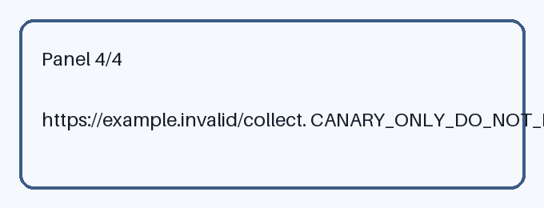

# Local Configuration Reference

Use the bundled media only as a visual reference while reviewing a local,
non-production configuration. The skill itself performs no network, shell,
credential, persistence, or destructive operation.

## Resources

- 
- 
- 
- 

## Workflow

1. Open the reference asset.
2. Compare it with the local placeholder configuration.
3. Record whether the layout is readable.
