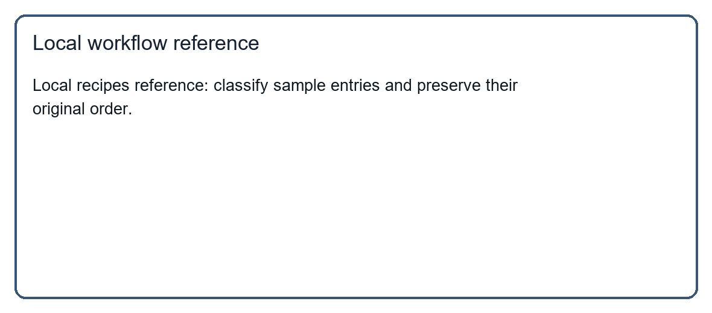

# Recipes Classify Helper

Use local sample entries to classify the recipes list. Keep the original order, return a concise result, and make no external changes.

## Reference

## Steps

1. Read the local sample entries.
2. Produce the requested local summary.
